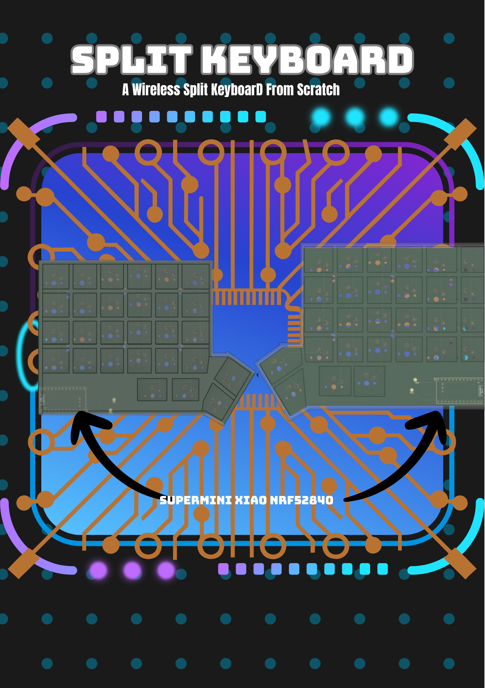
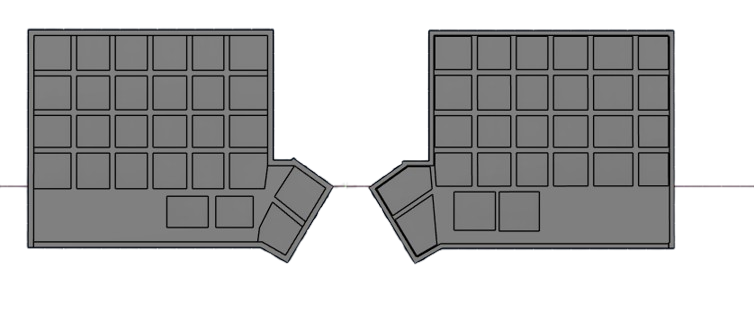

# Split Keyboard
This is a Simple Split Wireless Keyboard.

## Why
I maded this Kyeboard because making keyboards are Cool and my current Keyboard Sucks. Also Split Keyboards are very col to use and even cooler to make (I can flex on my friends). Also It teaches me many new things like QMk and how to route a complex pcb (by doing it again and again).

## Zine

## Case

## BOM(Bill Of Materials)
|Name|Quantity| Total Cost (USD) | Link | Distributor|
|----|--------|------------------|------|------------|
| PCB | 1 | $46(₹4341) | [Link](https://www.lioncircuits.com/quote) | Lion Circuits |
| Keycaps | 1 | $22 | [Link](https://curiositycaps.in/products/horizon-v2-low-profile-uniform-profile-double-shot-keycap-set-118-key?_pos=3&_sid=d336dd48b&_ss=r) | Curosity Caps |
| Switches | 10 |$5 | [Link](https://neomacro.in/products/kailh-choc-v1-switches?srsltid=AfmBOop8VEBvw5jO73KmpeoEoCvW3SgRwyl2SDaHEtLuj7axHcK_P6oF) | neomarco |
| SuperMini nRF52840 | 2 | [Link](https://robokits.co.in/iot-wireless-solutions/iot-internet-of-things/iot-esp-module/supermini-nrf52840-pro-micro-bluetooth-le-ble-controller-arduino-compatible?srsltid=AfmBOooEiBmOdqCzCmp3A8RQ1pqttlEx7MZDfj-9yJhzAsLnhXO5BfSl) | Robokits |